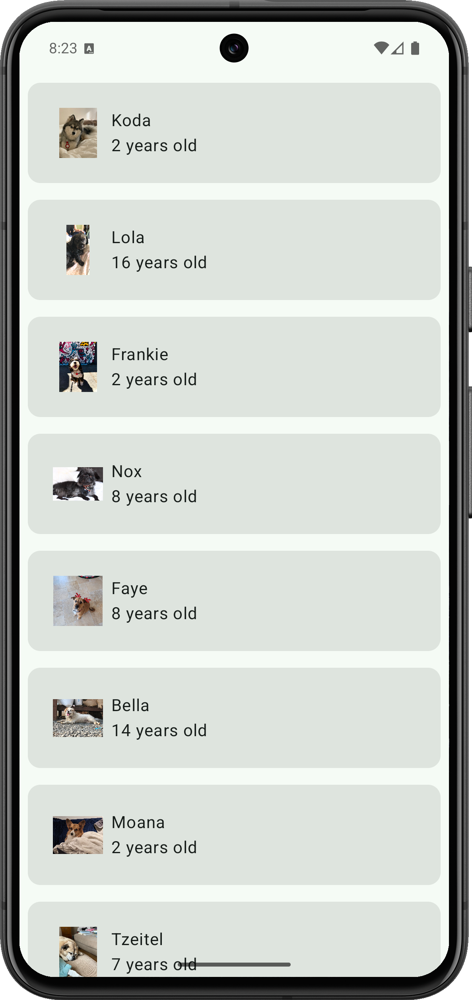
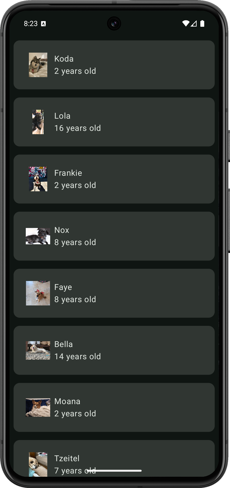
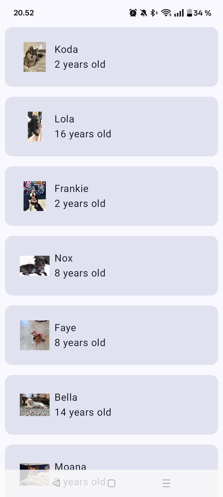
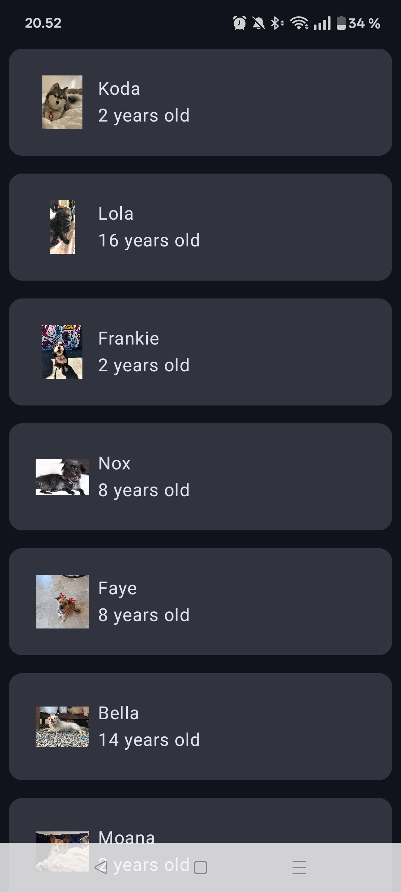
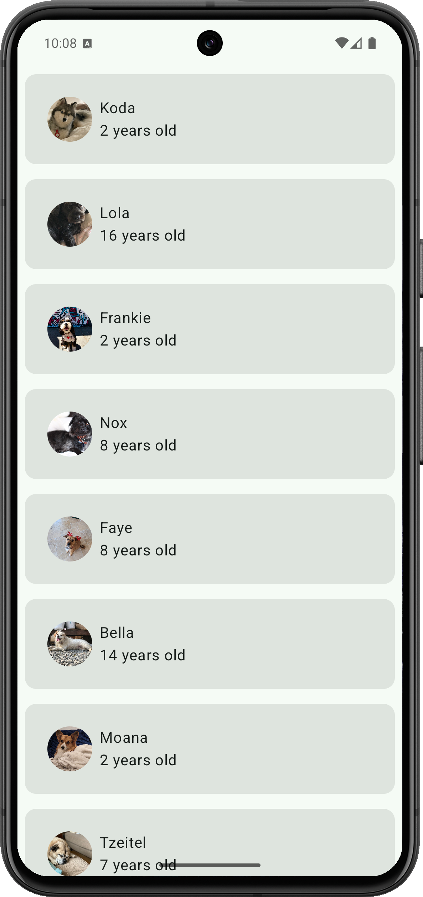
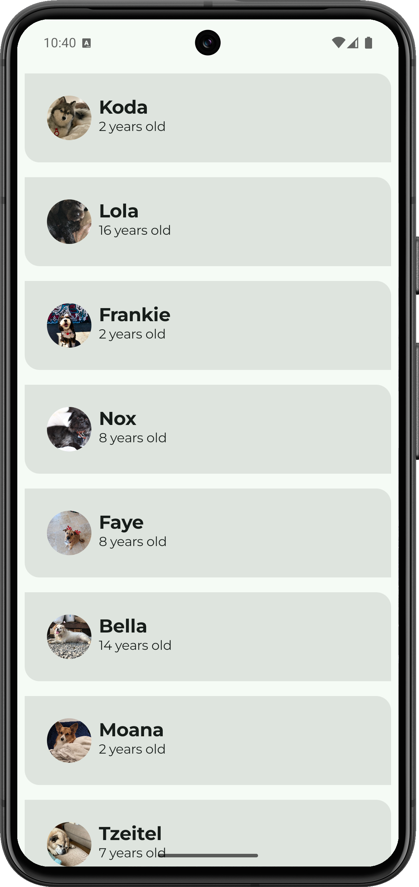
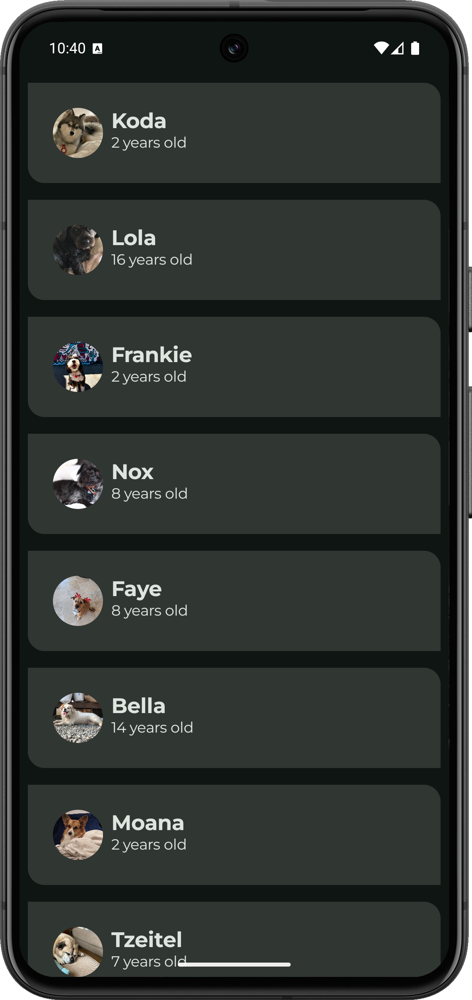
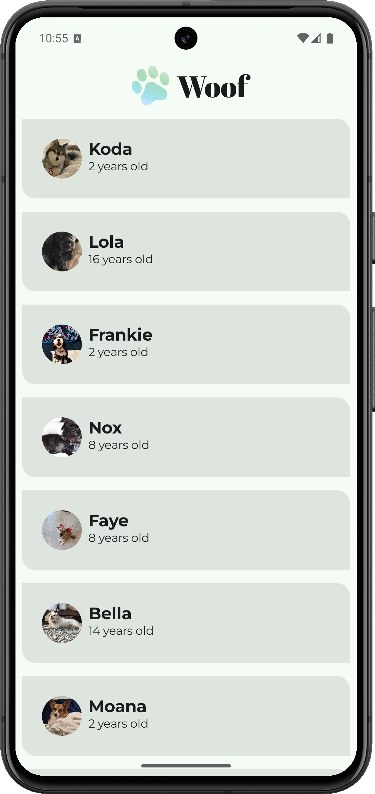
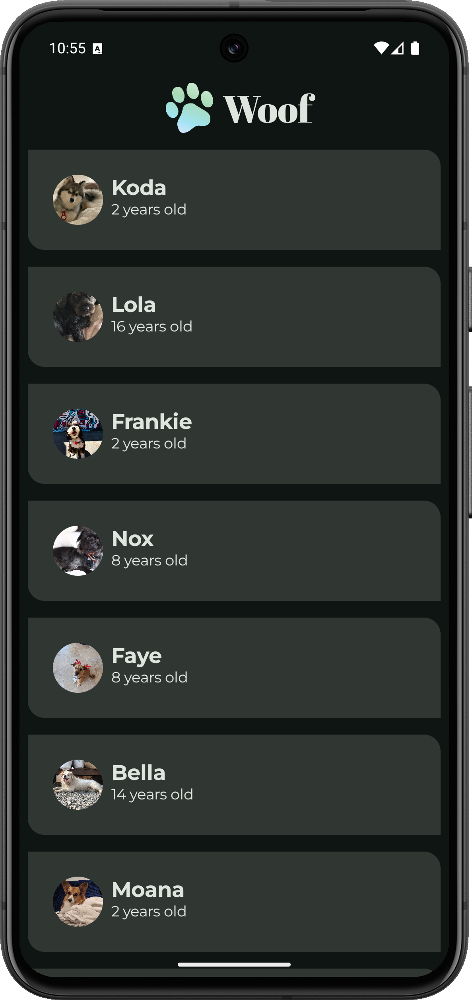

Woof App
==================================

The Woof app is a list of dog photos with information about them including their name, age, and favorite activity. This app also uses Material Design to create a beautiful app experience for the user.

Screenshots of the Woof App project progress
--- 
#### Light theme & Dark theme

 

#### Dynamic color theme 

 

#### Shapes

 

#### Typography

 

#### Final Woof App

 

Pre-requisites
--------------

- Rows/Columns
- Modifiers
- Scaffold
- Adding images
- Button click handlers
- Functions
- Classes
- Lists
- App architecture

Getting Started
---------------

1. Download the project
2. Open the project in Android Studio
3. Run the project
